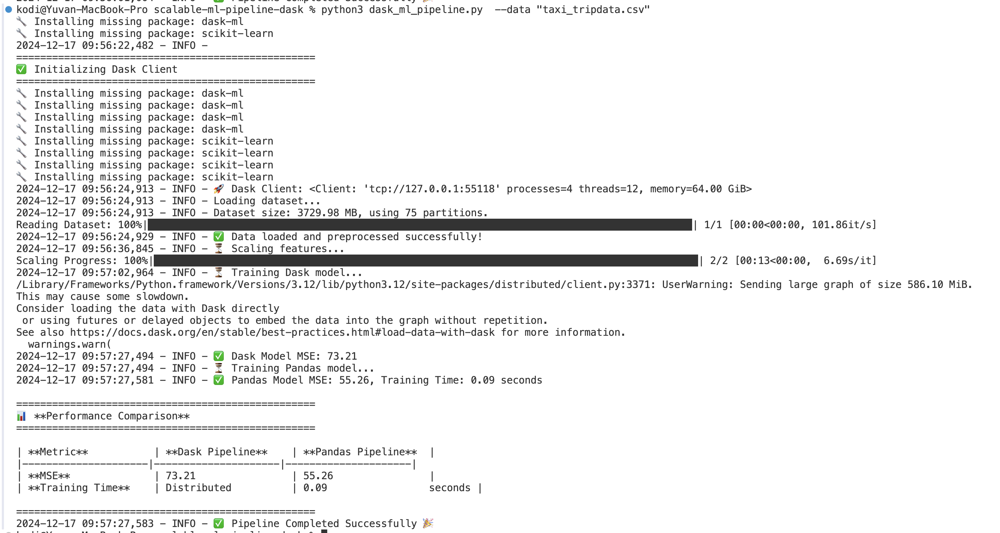

### Scalable ML Pipeline with Dask

#### Overview

This project builds a scalable machine learning pipeline using Dask and Dask-ML to handle large datasets efficiently, compare results, and visualize performance.

#### Tools & Technologies

| **Tool/Library**      | **Purpose**                           |
|------------------------|---------------------------------------|
| **Dask**              | Distributed data processing.          |
| **Dask-ML**           | Machine learning for large datasets.  |
| **Pandas**            | Data manipulation (small datasets).   |
| **Scikit-Learn**      | ML model training and evaluation.     |
| **Matplotlib**        | Data visualizations.                  |
| **tqdm**              | Progress bar for user feedback.       |
| **Subprocess**        | Automatic dependency installation.    |


#### **Dataset**

- **Name**: NYC Taxi Trip Data  
- **Features**:  
  - `trip_miles` - Distance  
  - `driver_pay` - Driver payment  
  - `tips` - Tip amount  
  - `base_passenger_fare` - Fare  
- **Source**: [NYC Taxi Dataset](https://www.nyc.gov/site/tlc/about/tlc-trip-record-data.page && https://d37ci6vzurychx.cloudfront.net/trip-data/fhvhv_tripdata_2024-09.parquet)

   - ***Download and Convert the parquet to csv***

      ***Download:-***  wget https://d37ci6vzurychx.cloudfront.net/trip-data/fhvhv_tripdata_2024-09.parquet

      ***Convert :-***  python3 -c "import pandas as pd; pd.read_parquet('fhvhv_tripdata_2024-09.parquet').to_csv('taxi_tripdata.csv', index=False)"


#### **Pipeline Workflow**

1. **Automatic Setup**: Installs required dependencies.  
2. **Data Loading**: Dynamic partitioning with Dask.  
3. **Preprocessing**: Clean data and engineer `fare_per_mile`.  
4. **Model Training**:  
   - **Dask**: Distributed training with Dask-ML.  
   - **Pandas**: Small-scale training with Scikit-Learn.  
5. **Evaluation**: MSE comparison and training time analysis.  
6. **Visualization**:  
   - **Predicted vs Actual Scatter Plot**.  
   - **MSE Comparison Bar Chart**.  


## **How to Run**

Run the script with the dataset:

```bash
python dask_pipeline.py --data "taxi_tripdata.csv"
```

## **Performance Comparison**

| **Metric**         | **Dask Pipeline**   | **Pandas Pipeline**  |
|---------------------|---------------------|----------------------|
| **MSE**            | 42.76               | 42.85               |
| **Training Time**  | Distributed         | 4.56 seconds        |

---

## **Outputs**

- **Visualizations**: Saved in `outputs/` folder.  
- **Results**: Saved in `results.txt`.  
- 
    